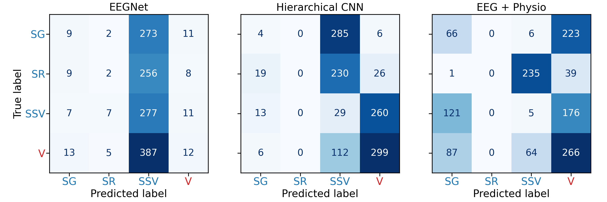

# BCI-hierarchical-eeg-classification

This repository contains the code for a Brain Computer Interfacing project comparing a flat EEGNet baseline with a hierarchical convolutional neural network for EEG-based digital activity classification.

## Table of Contents

- [BCI-hierarchical-eeg-classification](#bci-hierarchical-eeg-classification)
  - [Table of Contents](#table-of-contents)
  - [Important Files and Directories](#important-files-and-directories)
  - [Data](#data)
  - [Preprocessing](#preprocessing)
  - [Data Splits](#data-splits)
  - [Models](#models)
  - [Training and Evaluation](#training-and-evaluation)
  - [Results Visualization and Summary](#results-visualization-and-summary)

## Important Files and Directories

```text
├── Preprocessing.ipynb
├── README.md
├── data/
│   └── ds007537/
├── models/
│   ├── eegnet.py
│   ├── hierarchical_eeg_cnn.py
│   └── multimodal_eegnet.py
├── outputs/
│   ├── all_subjects_preprocessed.pkl
│   ├── eegnet_baseline/
│   ├── groupkfold_splits.pkl
│   ├── hierarchical_eeg_cnn/
│   ├── multimodal_fused/
│   └── test_confusion_matrices_comparison.png
├── req.txt
└── scripts/
    ├── create_splits_stratified.py
    ├── preprocess_physio.py
    ├── results/
    ├── train_eegnet_baseline.py
    ├── train_hierarchical_eeg_cnn.py
    └── train_multimodal.py
```

## Data

This project uses the [`ds007537`](https://openneuro.org/datasets/ds007537/versions/1.0.0) dataset as a DataLad/git-annex dataset. This dataset is located in the `data/ds007537` directory.

<!-- After cloning the repository, the visible files may only be lightweight placeholders. To download the actual data files, use `datalad get`.

### Setup Instructions

```bash
# Create the data directory
mkdir data

# Clone the dataset into the data directory
cd data
git clone https://github.com/OpenNeuroDatasets/ds007537.git

# Navigate to the dataset and fetch data using datalad
cd ds007537
```

#### Download the full dataset

```bash
datalad get .
```

#### Download a specific subject

```bash
datalad get sub-01
``` -->

## Preprocessing

The main preprocessing file is [Preprocessing.ipynb](Preprocessing.ipynb) used to preprocess the raw EEG data and save the preprocessed data as a pickle file for later use. Another script, [preprocess_physio.py](scripts/preprocess_physio.py), is used to preprocess the physiological data (heart rate and respiration) for the multimodal EEGNet model.

## Data Splits

The script [create_splits_stratified.py](scripts/create_splits_stratified.py) is used to create stratified group k-fold splits for cross-validation, ensuring that the distribution of classes is maintained across the splits. The generated splits are saved as a pickle file in the [outputs](outputs) directory and are later used for training and evaluating the models. This ensures that the models are trained and evaluated on consistent data splits and that no participant's data is present in both the training and testing sets, which is crucial for a fair evaluation of the models ability to generalize underlying patterns in the data rather than memorizing specific participant characteristics.

## Models

The [models](models) directory contains the implementation of the three models used in this project:

- [EEGNet Baseline](models/eegnet.py) contains the implementation of the EEGNet architecture, which serves as the baseline model for EEG-based digital activity classification. The implementation is based on EEGNet-8,2 proposed by Lawhern et al. [1]
- [Hierarchical EEG CNN](models/hierarchical_eeg_cnn.py) contains the implementation of a hierarchical convolutional neural network designed to classify EEG data in two stages. This model is adapted from the Hierarchical Flow Convolutional Neural Network proposed by Jeong et al. [2]
- [Multimodal EEGNet](models/multimodal_eegnet.py) contains the implementation of a multimodal EEGNet architecture that integrates EEG with physiological data. The EEG branch is adapted from EEGNet, while the multimodal design is motivated by prior EEG-based multimodal learning work. [1][3]

[1]: V. J. Lawhern, A. J. Solon, N. R. Waytowich, S. M. Gordon, C. P. Hung, and B. J. Lance, “EEGNet: a compact convolutional neural network for EEG-based brain-computer interfaces,” _Journal of Neural Engineering_, vol. 15, no. 5, p. 056013, 2018.

[2]: J.-H. Jeong, B.-H. Lee, D.-H. Lee, Y.-D. Yun, and S.-W. Lee, “EEG Classification of Forearm Movement Imagery Using a Hierarchical Flow Convolutional Neural Network,” _IEEE Access_, vol. 8, pp. 66941–66950, 2020, doi: 10.1109/ACCESS.2020.2983182.

[3]: R. Pillalamarri and U. Shanmugam, “A review on EEG-based multimodal learning for emotion recognition,” _Artificial Intelligence Review_, vol. 58, no. 5, p. 131, 2025.

## Training and Evaluation

The [scripts](scripts) directory contains the training scripts for each model:

- [train_eegnet_baseline.py](scripts/train_eegnet_baseline.py): Script for training and evaluating the EEGNet baseline model.
- [train_hierarchical_eeg_cnn.py](scripts/train_hierarchical_eeg_cnn.py): Script for training and evaluating the hierarchical EEG CNN model.
- [train_multimodal.py](scripts/train_multimodal.py): Script for training and evaluating the multimodal EEGNet model.

## Results Visualization and Summary

The results of the model evaluations, including confusion matrices and performance metrics, are saved in the [outputs](outputs) directory in each model's subdirectory as `results.json`. The [cms script](scripts/results/cms.py) is used to generate and save the confusion matrices for each and all models. For example:

<p align="center">
  
</p>

Furthermore, a summary of the results is provided extracted from the saved `results.json` files, by the [results_summary script](scripts/results/summary.py)
